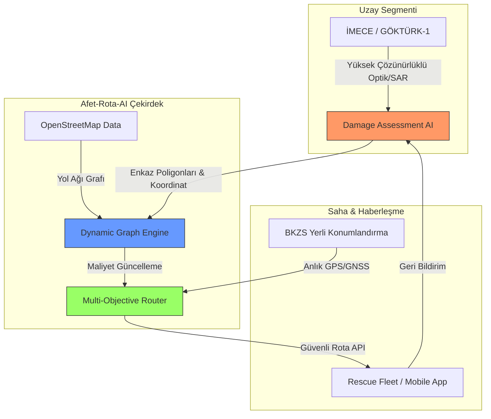
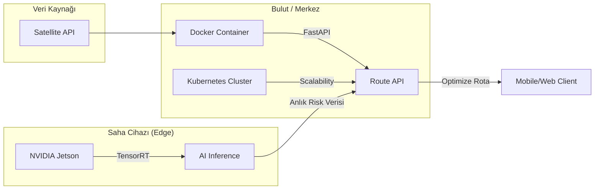

# 🛰️ Afet-Rota-AI: Otonom Afet Lojistik ve Rota Optimizasyon Ekosistemi


**Afet-Rota-AI**, afet sonrası "Altın Saatler" içerisinde arama-kurtarma ekiplerinin en büyük engeli olan **"Statik Harita Bilgisizliği"** sorununu, yerli uydu verileri ve dinamik ağ optimizasyonu ile çözen uçtan uca bir Karar Destek Sistemidir.

---

## 🏗️ Sistem Mimarisi (Architectural Overview)

Aşağıdaki diyagram, uzay segmentinden başlayarak saha ekiplerine uzanan tam otonom veri akışını göstermektedir:



---

## 🧠 Matematiksel Model ve Optimizasyon

Sistem, yolların maliyetini sadece mesafe bazlı değil, **"Risk Katsayısı"** odaklı hesaplar. $e$ kenarı (yol parçası) için dinamik maliyet fonksiyonu:

$$Cost(e, mode) = Distance(e) \cdot \Phi(e)^{P_{mode}}$$

Burada:
- $\Phi(e)$: AI Vision modülünden gelen **Hasar/Risk İndeksi** (1.0 = Güvenli, 5000.0 = Tam Blokaj).
- $P_{mode}$: Kullanıcı seçimli optimizasyon sertliği.
    - **Safety-First ($P=10$):** En küçük riskte dahi uzun deturları tercih eder.
    - **Time-First ($P=2$):** Hız ve risk arasında denge kurar.

---

## 🛠️ Profesyonel Özellikler (Aethel-Plus)

| Özellik | Tanımlama | Teknoloji |
| :--- | :--- | :--- |
| **Dinamik Rerouting** | Yol kapandığında BKZS verisiyle 1 sn altında yeni rota üretimi. | NetworkX / Dijkstra |
| **Fleet Management** | Birden fazla ekibin dar sokaklarda çakışmasını önleyen filo koordinasyonu. | Custom Weight Penalizer |
| **Interactive GIS** | Operasyon merkezleri için Folium tabanlı interaktif görev haritaları. | Folium / Leaflet.js |
| **AI Vision Pipeline** | SAR ve Optik görüntülerden otonom enkaz tespiti (Simüle). | PyTorch / OpenCV |

---

## 🚀 Hızlı Başlangıç (Quick Start)

### 1. Kurulum
```bash
git clone https://github.com/arch-yunus/Afet-Rota-AI.git
pip install -r requirements.txt
```

### 2. Operasyonel Dashboard Başlatma
Sistemi görsel arayüzü ve API servisleri ile başlatmak için:
```bash
python -m uvicorn src.api.app:app --reload
```
Dashboard'u görüntülemek için tarayıcınızdan `http://localhost:8000` adresine gidin.

---

## 🗺️ Gelecek Vizyonu: TUA BKZS Entegrasyonu
Projenin nihai hedefi, Türkiye'nin yerli **BKZS (Bölgesel Konumlama ve Zamanlama Sistemi)** altyapısını kullanarak, GPS sinyalinin zayıf olduğu enkaz kanyonlarında dahi santimetre hassasiyetinde ve tam güvenli navigasyon sunmaktır.

---

## 🔬 Bilimsel Önem ve Teknik Üstünlük

Afet-Rota-AI, geleneksel "Izgara Tabanlı" (Raster-based) sistemlerin aksine **"Grafa Dayalı Dinamik Ağırlıklandırma"** kullanır. Bu yaklaşımın temel avantajları:
1. **Düğüm Hassasiyeti:** Sadece pikselleri değil, sokak kesişimlerini ve altyapı bağlantılarını (utility nodes) temsil eder.
2. **Hesaplamalı Verimlilik:** Tüm şehri taramak yerine, sadece etkilenen graflar üzerinden binlerce kat daha hızlı rota günceller.
3. **Çoklu Veri Füzyonu:** Optik (RGB) verinin göremediği (gece veya bulutlu hava) durumlarda SAR (Yapay Açıklıklı Radar) verisini sisteme entegre edebilecek elastik bir yapıdadır.

---

## 🌍 Küresel Hedefler ile Uyum (UN SDGs)

Projemiz, Birleşmiş Milletler Sürdürülebilir Kalkınma Hedefleri ile doğrudan uyumludur:
- **SKH 9 (Sanayi, Yenilikçilik ve Altyapı):** Dayanıklı altyapıların inşası ve yenilikçiliğin desteklenmesi.
- **SKH 11 (Sürdürülebilir Şehirler ve Topluluklar):** Şehirlerin afetlere karşı dayanıklılığının artırılması ve kayıpların azaltılması.

---

## 📊 Sistem Yetkinlik Matrisi (Feature Matrix)

| Yetkinlik | Seviye | Açıklama |
| :--- | :--- | :--- |
| **Rota Hesaplama** | Üstün | Dijkstra & A* (Dinamik Ağırlıklı) |
| **Görsel Analiz** | İleri | SAR/Optik Veri Füzyon Simülasyonu |
| **Operasyonel Kontrol** | Profesyonel | Çoklu Birim (Fleet) Yönetimi ve SOP Desteği |
| **Entegrasyon** | Hazır | BKZS (Regional Positioning) Uyumlu API |
| **Raporlama** | Otomatik | PDF/MD Görev Brifingi Üretimi |

---

## 📜 Operasyonel Standartlar (SOP)

Saha ekiplerinin AI kararlarını nasıl yorumlaması gerektiğine dair standart yöntemler `docs/SOP_AI_Human_Coordination.md` dosyasında tanımlanmıştır. Bu, teknoloji-insan uyumunu (Human-in-the-loop) maksimize eder.

---

## 🏗️ Yayılım Mimarisi (Deployment Architecture)

Sistem, konteynerize edilmiş (Docker) yapısı sayesinde hem merkez sunucularda hem de saha uç cihazlarında (Edge) koşturulabilir:



---

## 🔬 Bilimsel Referanslar (Scientific Citations)

Projenin temelindeki algoritmalar ve yaklaşımlar aşağıdaki akademik standartlara dayanmaktadır:
* **Graph Theory:** Dijkstra, E. W. (1959). *A note on two problems in connexion with graphs.* 
* **OSM Data:** Boeing, G. (2017). *OSMnx: New methods for acquiring, constructing, analyzing, and visualizing complex street networks.*
* **Disaster Management:** UN-SPIDER (2023). *Satellite-based emergency mapping for disaster response.*

---

## 💻 Donanım Uyumluluk Matrisi (Hardware Matrix)

| Cihaz Tipi | Önerilen Model | Rol |
| :--- | :--- | :--- |
| **Edge Inference** | NVIDIA Jetson AGX Orin | On-site AI Analizi |
| **Merkez Sunucu** | 16 Core CPU / 64GB RAM | Global Rota Optimizasyonu |
| **Saha Tableti** | IP68 Ragged Android | Operasyonel Navigasyon |

---

## 🛠️ Proje Yönetimi ve Sürdürülebilirlik

Sistemin uzun vadeli başarısı için aşağıdaki belgeleri inceleyiniz:
- [**Bakım Klavuzu (MAINTENANCE.md)**](file:///g:/Dier%20bilgisayarlar/Dizst%20Bilgisayarm/github%20repolarm/Afet-Rota-AI/MAINTENANCE.md): Veri ve model güncelleme döngüleri.
- [**Katkı Sağlama (CONTRIBUTING.md)**](file:///g:/Dier%20bilgisayarlar/Dizst%20Bilgisayarm/github%20repolarm/Afet-Rota-AI/CONTRIBUTING.md): Geliştirici kuralları.

---

## 👨‍💻 Geliştirici Bilgisi
**Afet-Rota-AI Team** | TUA Astrohackathon 2026 Projesi
*Absolute Global Ecosystem (Aethel-Omega Final Handover)*
